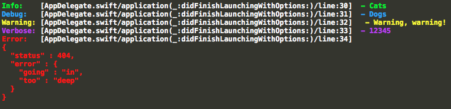

<!--  -->

# The Swift logging framework.

`Atlantis` is an extremely powerful logging framework that I've created for everyday use, including enterprise development for aspiring start-ups or for rapid prototyping API's. It is **type agnostic**, meaning you can pass in anything from `strings` to custom`objects` that you yourself made... and it will basically **pretty print** all the values within that object or literally anything in general. It is made with exceptional readability and ease of use.

### Installation

Add this to your [podfile](https://cocoapods.org/)...

```swift
pod 'Atlantis'
```

Then do a pod install, and voila!

## Filterable Log Levels
This includes the stamp trace of the source file, function name, and line number.

```swift

// I suggest initializing this variable in the global instance
let log = Atlantis.Logger()

// Let's log some stuff
log.verbose("Hello, World!")
log.info("Hello, World!")
log.warning("Hello, World!")
log.debug("Hello, World!")
log.error("Hello, World!")
```

Which prints the following...


## Powerful Printing

`Atlantis` is built to `pretty print` literally everything.

### - `optionals`

```Atlantis``` will safely unwrap any optionals.

```swift
let doIExist: String? = nil

log.warning(doIExist)

// prints 'nil'
```

### - `native types`

``` swift
let string = "Hello, World"
let int = 123
let double = 12.3
let float = 12.3
let bool = true

// you can either log one value
log.debug(string)

// or all of them like so,
log.debug(string, int, double, float, bool)

// prints
"Hello, World" // first one

"Hello, World" // prints each with a new line
123
12.3
12.3
true
```

### - `arrays`
```swift
// array of ints
let numbers = [123, 1234, 12345]

log.debug(numbers)

// prints
[
	123,
	1234,
	12345
]
```
```swift
// lets try arrays of arrays
let numberArray = [[1, 2, 3], [4, 5]]

log.debug(numberArray)

// prints
[
	[
		1,
		2,
		3
	],
	[
		4,
		5
	]
]
```

### - `dictionaries`

```swift
// on to dictionaries...
let dictionary: [String: AnyObject] = [
	"quote": "It is better to have loved, that to have never loved at all?"
] 

log.debug(dictionary)

// prints
[
	"quote": "It is better to have loved, that to have never loved at all?"
]
```

```swift
// how about NSDictionary types?
var dictionary = NSDictionary()
dictionary.updateValue("will this work?", key: "question")

log.debug(dictionary)

// prints
[
	"question": "will  this work?"
]
```

### - `objects`
```swift
// now let's get to the fun part,
```
```swift
// native Foundation (ex: UIView, UIColor, etc.)

log.debug(UIColor())

// prints
<UIPlaceholderColor: 0x7ff1fb517ab0>
```

```swift
// native NSObjects

public class Dog: NSObject {
  var name = "Doug"
}

let dog = Dog()

log.debug(dog)

// prints 
{
	"name": "Doug"
} 
```
``` swift
// But what about objects you created with no native subclasses?

public class CustomObject {
	var id: Int = 123
	var name: String = "Ben"
}

let customObject = CustomObject()

log.debug(customObject)

// prints
{
	"id": 123,
	"name": "Doug"
} 

// Haha, no way?
```

```swift
// Alright, well how about custom objects with custom objects in them?

public class ParentObject {
	var id: Int = 456
	var name: String = "Tammy"
	var customObject: CustomObject = CustomObject()
}

let parentObject = ParentObject()

log.debug(parentObject)

// prints
{
	"id": 456,
	"name": "Tammy"
	"customObject": {
		"id": 123,
		"name": "Doug"
	}
} 

// That's right.
```

```swift
// Okay, custom objects with an array of custom objects. ;)

public class ParentObject {
	var id: Int = 456
	var name: String = "Tammy"
	var customObjects: [CustomObject] = [CustomObject(), CustomObject()]
}

let parentObject = ParentObject()

log.debug(parentObject)

// prints
{
	"id": 456,
	"name": "Tammy"
	"customObjects": [
		{
			"id": 123,
			"name": "Doug"
		},
		{
			"id": 123,
			"name": "Doug"
		}
	]
} 
```

```swift
// Not impressed? 

let parentObject1 = ParentObject()
let parentObject2 = ParentObject() // one of it's child has a dictionary 

let parents: [ParentObject] = [parentObject1, parentObject2]

log.debug(parents)

// prints
[
	{
		"id": 456,
		"name": "Tammy"
		"customObjects": [
			{
				"id": 123,
				"name": "Doug"
			},
			{
				"id": 123,
				"name": "Doug"
			}
		]
	},
	{
		"id": 456,
		"name": "Tammy"
		"customObjects": [
			{
				"id": 123,
				"name": "Doug"
			},
			{
				"id": 123,
				"name": "Doug"
				"dictionary": [
					"likes": "baseball",
					"dislikes": "pad thai"
				]
			}
		]
	}
]

// Atlantis' logging is infinitely and ambiguously recursive,
// it supports almost all data types including arrays, dictionaries, 
// and any objects within any objects. 👍🏼
```

## .Tap
Tap is an `Atlantis` extension that allows you to print like how you would regularly do, but will return the value of the input.

```swift
func add(x: Int, _ y: Int) -> Int { return x + y }

let addXY = log.tap.debug(add(3, 5))

// prints 8 and assigns the value to addXY
```

Normal extensions such as ```.Verbose``` etc. are also under ```.Tap```

#### Compatible with ```Promises```

using [PromiseKit](https://github.com/mxcl/PromiseKit) more specifically...

```swift
func promise() -> Promise<String> {
  return Promise { fulfill, reject in
    // blah blah
    fulfill("Hello from server!")
  }
}

promise()
.then { log.tap($0) }
.then { reply in
  // blah blah
}
.catch { log.error($0) }

// prints "Hello from server!" while completing the promise.
```
Note that `.Tap` can only take in single inputs.

## Custom Configuration

```swift
Atlantis.Configuration.logLevel // default .Verbose
```

The five log levels are: `Verbose`, `Info`, `Warning`, `Debug`, `Error`, and `None`, ordered by priority. 

For example, if you set the log level to `Debug`, `Atlantis` will only print logs whose levels are `Debug` and `Error`.

Setting the log level to `.None` means `Atlantis` will skip all log execution. I recommend using this when the app is shift off to production.

```swift
Atlantis.Configuration.showExtraInfo // default true
```

You can also hide the source details by setting this parameter to false.

`Atlantis` is able to provide full color customization,

```swift
// colors
Atlantis.Configuration.hasColoredLogs // default false
Atlantis.Configuration.hasWhiteBackground // default false
Atlantis.Configuration.coloredLogLevels // default [.Verbose, .Info, .Warning, .Debug, .Error] 

// using a Tuple initializer

Atlantis.Configuration.logColors.info = Atlantis.XCodeColor(fg: (Int, Int, Int)>, bg: <(Int, Int, Int)>)

// using UIColor setting only the foreground

Atlantis.Configuration.logColors.info = Atlantis.XCodeColor(fg: UIColor)

// or using UIColor setting both the foreground and background

Atlantis.Configuration.logColors.debug = Atlantis.XCodeColor(fg: UIColor, bg: UIColor)
```

By default, `Atlantis` doesn't print its logs in colors. if you want colors, you will need to set the configuration during launch.

However, for you to enable log colors you will have to first download the xcode package manager [Alcatraz](http://alcatraz.io/) and enable it inside xcode. Pull up the package manager afterwards and install [XCodeColors](https://github.com/robbiehanson/XcodeColors).

```swift
Atlantis.Configuration.highlightsErrors // default false
```

`Atlantis` will print all errors like so,

```swift
Error: [ViewController.swift/viewDidLoad()/line:98] 
{
  "code" : 404,
  "localizedDescription" : "The operation couldn’t be completed. (Hello, World! error 404.)",
  "domain" : "Hello, World!",
  "userInfo" : {
  	"error": "found"
  	"note": "syntax"
  }
}
```

It will automatically parse the localized description, error code, domain, and user info from the `NSError` object.

By default, `Atlantis` will print all logs equally in white or in color if colored logging is enabled. However, if you enable error highlighting it will always highlight errors regardless of any set parameters.

```swift
Atlantis.Configuration.filteredErrorCodes
```

`Atlantis` has the ability to filter out errors based on their error code. For example, you have a method that sends requests to the network and you made it so it can only make one request at a time so it will always cancel the last request made. However, some APIs are out of our control and will send out errors without your permission. 

Say you want to filter out error code `-1099 // offline error`, 

```swift
Atlantis.Configuration.filteredErrorCodes.append(-1099)

// let's call a method that throws errors, however one of the 
// errors is something we want to filter out.
method() { error in 
	log.error(error) // can either be error 404 or -1099?
}
```

Now, if the method throws a `404` error, `Atlantis` will log it and will skip over errors with a `-1099` code!

## Afterword
### To Do
1. ~~create a logging framework~~
2. ~~add color customization~~
3. print to a text file when used on a device
4. ~~pretty print json types from server responses~~

### License
The MIT License (MIT)

Copyright (c) 2015 Andrew Aquino http://drewkiino.github.io/

Permission is hereby granted, free of charge, to any person obtaining a copy
of this software and associated documentation files (the "Software"), to deal
in the Software without restriction, including without limitation the rights
to use, copy, modify, merge, publish, distribute, sublicense, and/or sell
copies of the Software, and to permit persons to whom the Software is
furnished to do so, subject to the following conditions:

The above copyright notice and this permission notice shall be included in all
copies or substantial portions of the Software.

THE SOFTWARE IS PROVIDED "AS IS", WITHOUT WARRANTY OF ANY KIND, EXPRESS OR
IMPLIED, INCLUDING BUT NOT LIMITED TO THE WARRANTIES OF MERCHANTABILITY,
FITNESS FOR A PARTICULAR PURPOSE AND NONINFRINGEMENT. IN NO EVENT SHALL THE
AUTHORS OR COPYRIGHT HOLDERS BE LIABLE FOR ANY CLAIM, DAMAGES OR OTHER
LIABILITY, WHETHER IN AN ACTION OF CONTRACT, TORT OR OTHERWISE, ARISING FROM,
OUT OF OR IN CONNECTION WITH THE SOFTWARE OR THE USE OR OTHER DEALINGS IN THE
SOFTWARE.
